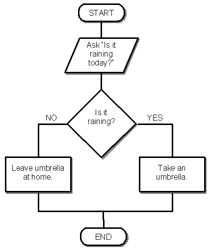
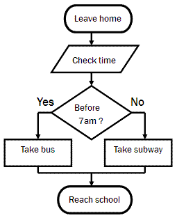
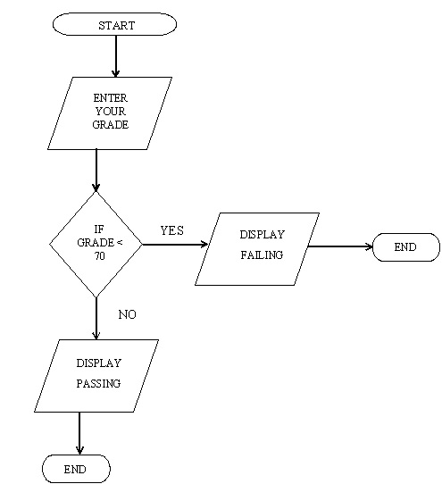

# Introduction to Logic

##### AGENDA
- Write decision trees
- Explain the principals of logic AND/OR
- Use if/else in JavaScript

##### LEARNING OBJECTIVES
- SWBAT Diagram Logic Trees
- SWBAT Process Logical Expressions
- SWBAT Use `if`/`else` expressions in JavaScript

### STEP 1: Flowcharts (20 minutes)

For each flowchart:
- Walk through the logic,
- Code the logic as an `if/else` statement

# IS IT RAINING? [I]
> CLOSE YOUR COMPUTERS



```js
var isItRaining;
isItRaining = alert("Is it raining today?");

if (isItRaining === "yes") {
  alert("Take an umbrella.")
} else {
  alert("Leave umbrella at home.")
}
```

- Discuss difference between `==` and `===`
- What happens if I type `YES` instead?  Can we fix our code so it will understand?

---

# GETTING TO CLASS [W]
> Now, let's do one together...



> Wait... Why are we asking the user for the current time?
>
> Doesn't the computer know what time it is?

Search: `mdn Time` - click Date

- Introduce `new Date()`
- Introduce `date.getMinute()`
- Introduce `date.getHour()`

# PASSING A CLASS [Y]
> Your Turn...



---

## BREAK (15 minutes)

---

**STUDENT NAVIGATOR**
> Tell me how you did it!

---

## A Base2 Accident [I] (5 minutes)

*Type the number `0132` into a JavaScript Console.*
> What the...

Search: `mdn parseInt` - to pull up docs and discuss "Base"

`parseInt("369", 10)`

---

**Wanna see a neat trick?**

`parseInt("1010111", 2)`

> Woah!  We can convert binary code!

---

##### Explain Base2 / Binary  (write vocab for both)

```
0 = false
1 = true
```

> How deep does this Alice in Wonderland stuff go?

---

### STEP 2: Logic Tables (10 minutes)

##### Explain LOGIC  (write vocab)

| NOT | |
|-----|-|
| 1 | 0 |
| 0 | 1 |

| AND   | | |
|-------|-|-|
| 0 | 0 | 0 |
| 0 | 1 | 0 |
| 1 | 0 | 0 |
| 1 | 1 | 1 |

| OR    | | |
|-------|-|-|
| 0 | 0 | 0 |
| 0 | 1 | 1 |
| 1 | 0 | 1 |
| 1 | 1 | 1 |

> My god... class.  I think I have something to announce.  We may have just uncovered the secret for AI.  My computer can THINK!

---

```
var grade = parseInt(prompt("What is the student's grade (as %)?"))
var absent = parseInt(prompt("How many days absent?"))

if (grade < 70 || absent > 4) {
  alert('Failing!')
// } else if (...)
} else {
  alert('Passing!')
}
```
> Neato!

### ACTIVITY [Y]

Using `else if` write the conditional to ask the user "How many tardies?" and alert "Chronically late" if `tardies > 4` or `absent > 2`
