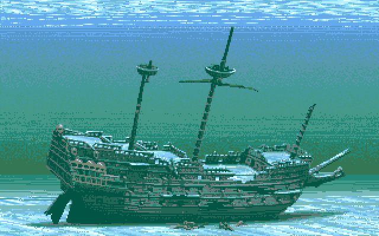

# Ship Search



```js
var ships = [
  {
    name: 'The Titanic',
    lost: 1912
  },
  {
    name: 'The Santa Maria',
    lost: 1492
  },
  {
    name: 'HMS Bounty',
    lost: 1790
  },
  {
    name: 'Old Ironsides',
    lost: null
  },
  {
    name: 'Potemkin',
    lost: 1923
  },
  {
    name: 'USS Monitor',
    lost: 1862
  },
  {
    name: 'HMS Dreadnought',
    lost: 1923
  },
  {
    name: 'Bismarck',
    lost: 1941
  },
  {
    name: 'HMS Beagle',
    lost: 1870
  },
  {
    name: 'Nuestra Señora de Atocha',
    lost: 1622
  }
]
```

- Print the names of all of the ships

#### Using `map`

- Get just the names of all of the ships
- Get all of the years when ships were lost

#### Using `filter`

- Get the (name/year) of all of the ships that were lost *after 1900*
- Get the (name/year) of all of the ships that were lost *before 1900*
- Get the (name/year) of all of the ships that were lost between 1800-1899
- Get all of the ships with HMS in their name
