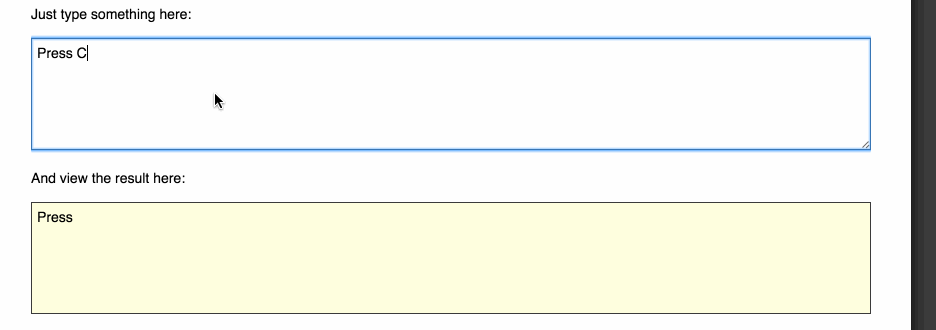

#  Homework



## The Premise
Sometimes we say "press `command` `option` L" and we have to write out the whole word - which is tiresome. Your computer conveniently has nice icons for those words. Wouldn't it be great if you had an app that translated for you? Luckily, you're a web developer, so you can build that! Tonight you are going to build a single page app that translates from English to icon. This is where it starts getting real.

## Setup

Work in the `u2-the-browser/d10-do-it/student` directory. Make a `homework` directory in which you put your work. Touch a `key_translator.html` file and `key_translator.js` file. Link one to the other (you know which one!)

## Completion
Complete all 4 parts.

As always: more is better; healthy living is best.

Only do the bonus if you have completed every single part.

## Part 1
Copy the starter `<body>` outline below into your `key_translator.html` document. Under `<h2>Useful Icons</h2>`, create an HTML table in which you display the following icons with their English prompts:

  ⌘ Command
  ⇥ Tab
  ⏎ Return
  ⌥ Option
  ⌃ Control
  ⎋ ESC
  ← Left
  ↓ Down
  ↑ Up
  → Right
  ⇧ Shift
  ⏏ Eject
  ⇪ Caps (Lock)

```html
<body>

  <p>It's hard to type out those icons. Enter text below and get the pretty output</p>

  <h2>Useful Icons</h2>

  <p>Type Here.</p>

  <p>Output Here.</p>

</body>
```

## Part 2
Under `<p>Type Here.</p>` and `<p>Output Here.</p>`, make appropriate `html` tags to make an input area for someone to type in English and an output area where that someone can get pretty pretty icons in return. Give classes to those areas so that you can target them for event listeners.

## Part 3
Write functions that pull value from the input area, generates the appropriate icon (based on the icons and words listed in Part 1), and alters the output area.

## Part 4
Write an event listener that executes the functions you wrote in Part 3.

## BONUSES

## Bonus #1
Make your functions process both uppercase and lowercase input, without hardcoding both options.

## Bonus #2
Add CSS styling to the page to make it look nice.

## Bonus #3
Write function(s) that take input like "Save", "Print", or "Find", and output the combination of icons and letters that would result in that action.
