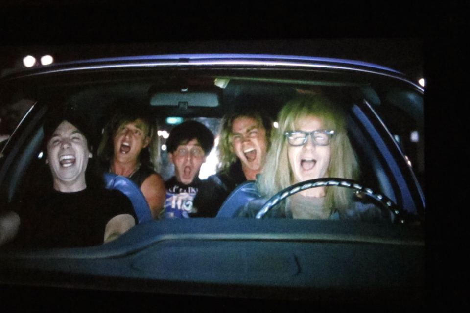

# Excellent!

> Rackup and party on.

## Learning Objectives

- Gettin' heavilly metallic with jQuery events
- Gettin' the net of CSS selectors

## Setup

Work in today's `homework` folder. You'll be primarily coding in `javascripts/main.js`. Don't touch the CSS or HTML files, this is purely a JS exercise.

## Resources

- [jQuery Docs](http://api.jquery.com/)

## Completion

Completion for this homework is 4 parts. This assignment is not sequential. If something's not working move on and come back later. As always, more is better, healthy living is best.

## Part 1 - Way **NO** Way

Add an event listener to the the "button.way-no-way" so that when you click on it, the **text** of the button toggles between "no way" to "way"

## Part 2 - Toggle On Wayne

Add an event listener to the "span.name" so that when you click on it
- add the ***class*** "hidden" to it
- remove the ***class*** "hidden" from "input.input-name"
- set the value of "input.input-name"' to the text of "span.name"

## Part 3 - Toggle off Garth

Add an "keypress" event listener to "input.input-name" so that when you type in a name and hit "return"
- the class "hidden" is added to "input.input-name"
- the class "hidden" is removed from "span.name"
- the value from "input.input-name" is set to the text of "span.name"

## Part 4 - Extreme Close-up

Add an event listener to "img.extreme-closeup" so that when you fire a mousedown event make the element's CSS ["transform: scale(n)"](https://developer.mozilla.org/en-US/docs/Web/CSS/transform#scale) property __continually__ increase.

## Part 5 - That was a good buzz! Alright!

Add an event listener to "img.extreme-closeup" so that when you fire a mouseup event, the element's CSS "transform: scale(x)" property revert back to "scale(1)"

## Part 6 - Top Fives

Add an event listener on "keypress" to "input.input-phrase" so that when you type in some text and hit "return"
- the text is appened to "div#phrases" as a "p" tag
- the value of "input.input-phrase" is cleared out.

# Part 7 - Not!

Update the above event listener on "input.input-names" so that when a new p tag is created an event listener is added so that when you "click" on a p tag, the text "... NOT" is added to the end of the text.

# Excellent -  Bonus

- Update your code so that if 5 p tags have had "... NOT" appened to them
  - add the class "show" to "div.flash"
  - remove the class "show" after 3 seconds.
- Go to [caniuse.com](http://www.caniuse.com), and search the `transform` rule. What browsers is this incompatible with? Think on this for a while...

- Bonus Readings on CSS:
  - [Absolute vs. Relative Positioning](https://codemyviews.com/blog/the-lowdown-on-absolute-vs-relative-positioning)
  - [What is display:inline-block?](http://designshack.net/articles/css/whats-the-deal-with-display-inline-block/)
