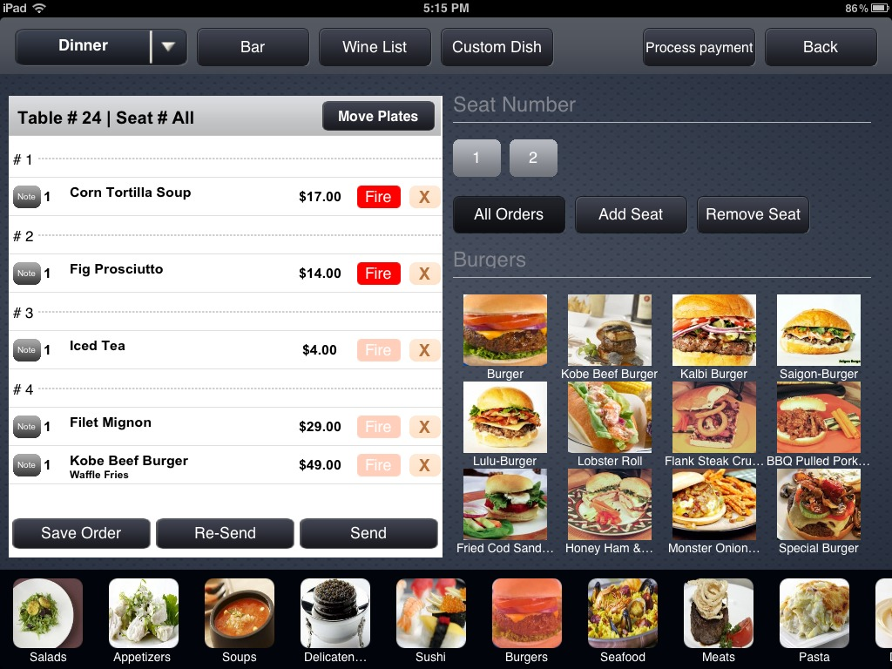

# Point of Sales Guide

This guide has been setup to provide suggestions and direction for your project.  This document *is not* a mandate, and exists only to guide you if you get stuck.



---

### STEP 1: The Menu

Before you get started on the UI, you should begin by collecting all of the items you intent to sell through your interface.

You may want to organize them into categories, such as "Soups", "Salads", "Beverages", etc.

```js
var menu = {
  burgers: ["Hamburger", "Cheeseburger", "Turkey Burger"],
  salads: ["Cobb Salad", "Caesar Salad"]
  // ...
}
```

Eventually, you will need to know more than just their name.  At this point, a string simply won't do.

```js
var menu = {
  burgers: [
    {name: "Hamburger", price: 9.95},
    {name: "Turkey Burger", price: 8.95}
  ],
  salads: [
    {name: "Cobb Salad", price: 7.95},
    {name: "Caesar Salad", price: 6.50}
  ]
}
```

### STEP 2: The Interface

Scaffold out the basic structure of the interface.  Leave a space for your menu items, but *do not* populate them yet.  You should generate the items using the data.

Once you have everything looking nice, use jQuery to create each of the buttons by looping/iterating through the menu.  For custom images, consider giving each item a CSS "class" and giving each one a `background-image`.

### STEP 3: The Order

Click on an item in the menu should cause a line-item to be added to a order.  The total should then be recalcuated based on the items in the order.  *Don't* try to add/subtract from a `total`, instead recalculate the total on every update.

Taxes vary state-to-state, so you should use a variable that you can change later.  The New York City sales tax is 8.875% (`0.08875`).

Any tips should be added to the order before it is placed.

A server should be able to track multiple orders *at the same time* and switch between them.  Keep that in mind as you are writing the code.
