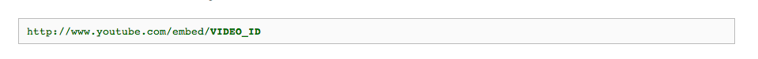
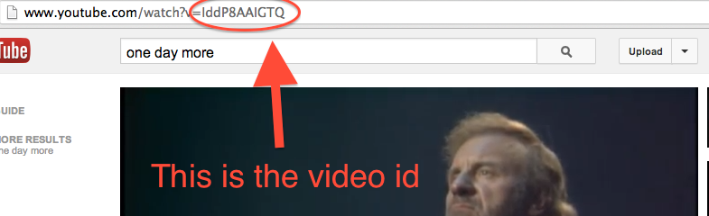

# Star Stalker


Star Stalker is a fan site dedicated to stars of all kinds, both living and dead. You'll have a database, and a Sinatra server. This exercise will help you bridge the gap between frontend and backend, making you all full stack developers.

## Learning Objectives

- Keeping our code DRY with templates!
- Becoming full stack developers.

## Completion

Completion for this assignment is to get through part 4.

## Setup

### The Server

Within your `star_stalker` directory, add the following directory structure.
Make sure you can  effectively start your server before moving on to part two.

```
hw_star_stalker_app
├── config.ru
├── star_power.rb
├── app.rb
├── db <--- holds db setup file
├── public
│   ├── stylesheets
│   │   └── style.css
│   └── images  
│       ├── youtube_url.png
│       └── youtube_id.png
└── views
    ├── index.erb
    └── default_layout.erb
```

### The Database

## Setup

Start by creating a database **in terminal** by running:

`createdb star_stalker`

Then seed with our preset data the database by running:

`psql -d star_stalker -f db/star_stalker_seeds.sql`

This tells postgres to run the file `star_stalker_seeds.sql` in the `star_stalker` database, as one would imply from the `-d` and `-f` flags.

In your `server.rb` file make sure to initialize a database connection using the `pg` gem. (It should be required before your code runs)

`$db = pg.connect dbname: 'star_stalker'`


#### Part 1: Setting Up a Default Layout

Every page of this app should have a header that serves as a navigation bar for your entire app. Create a file called `defalut_layout.erb` in your `views` folder and serve it for each route handler in this app. If should link to your main css stylesheets. In the body, simply place your `<%= yield %>` tag to load individual layouts. The header itself should provide anchor tags to the following links:
  - to `"/about"`
  - to `"/stars"`
  - to `"/"`


#### Part 2: The Root

GET requests made to the root url should welcome visitors to StarStalker.com, home of celebrity info and multimedia (get creative if you feel like it). Write your code in `views/index.erb`, and in your Sinatra route handler make sure it renders inside the default layout.

#### Part 3: The `"/about"` page

GET requests made to `"/about" should render `about.erb`, and should display a heading that says "About Star Stalker", followed by some text explaining the origins of Star Stalker (who runs it, when it was established, and so on).

#### Part 4: The `"/stars"` page

GET requests to `"/stars"` should display an unordered list of names for each of the stars provided in the `star_stalker` database. Each list item should also be a link, following the pattern below.

In your route handler, pull all of the names from the `stars` table for use in your view.

Create a file `stars.erb` that will iterate through this collection and generate a list item for each name. The links should follow the pattern below:

#### Link pattern:

Jim Morrison is at the key 1, so the link representing him should go to `"/stars/1"`
Michael Jackson is at the key 2, so the link representing him should go to `"/stars/2"`
Madonna is at the key 3, so the link representing her should be `"/stars/3"`
...and so on.

#### Part 4: Star Profiles

Create a dynamic star profile page, so that GET requests to `"/stars/1"` displays the info for the star at the key 1 within the `stars` table, and GET requests to `"/stars/27"` would display the info for the star at the key value 27 (once we have that many stars)

For each star, display their name, date of birth, and photo. So like before, pull from the database the information you need and render it in your own `.erb` file, or "partial", as the nomenclature goes.

### BONUS

#### Part 6: A Star is Born

Create a new route, ` get '/stars/new'` that renders a form for a new star.

### Table Layout

The table for stars in star_stalker looks like so:

|Columns|Type|
|---|---|
|id| INTEGER |
|alive| BOOLEAN |
|born_on| DATE |
|image_url| TEXT |
|embed_id| TEXT |

---

Use the database table layout above to infer what kind of data you need to ask for on the form. DO NOT ASK FOR AN ID ON YOUR FORM, WHY WOULD YOU DO THIS. Boolean values should be entered via a radio button or select type input. Research online how to make this work. Make sure each input has a `name` attribute so that rack can put it into `params` on submission.

#### Part 6: Saving to the DB

Write your `post "/students"` route handler which will handle form data and create a new star in the database.


#### Part 7: Filtering The Stars in Your Gallery

Make it so that GET requests to `"/stars?alive=false"`, lists only deceased stars. Similarly, if someone makes a GET request to `"/stars?alive=true"`, the list should only show the stars that are still alive. Hint: You don't have to add another route handler, just edit your erb with a conditional based on if the [query parameter](https://en.wikipedia.org/wiki/Query_string) exists in the params hash.

#### Part 8: Video!

Read up on [how to embed a youtube video](https://developers.google.com/youtube/player_parameters#Embedding_a_Player) in a webpage.

Here's what the url looks like:


Here's here you find the video_id:


#### Part 9: Lookin' Good

1. Add `normalize.css`
1. Center your pages with `margin: 0 auto; width: 960px`
1. Add `:hover` effects to all your links
1. Run your CSS through the [CSS Validator](http://jigsaw.w3.org/css-validator/) and make the appropriate changes so it's all valid.
