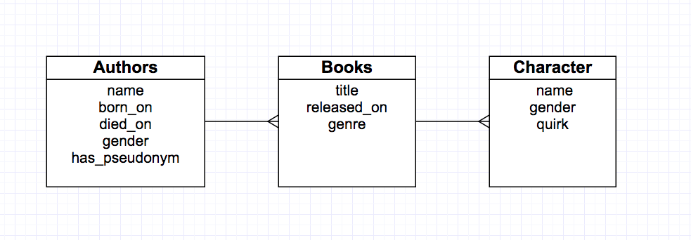

# Bookish CRUD

You've been tasked with building a three-model Rails CRUD App that allows bookish types to track their favorite authors' books and characters.

__[REQUIRED WATCHING BEFORE YOU BEGIN](https://www.youtube.com/watch?v=-fQ-bRllhXc)__

## Learning Objectives

- Practice reading ERDs
- Practice creating new rails apps from scratch
- Practice using rails generators
- Using template views using our view helpers

## Completion

Finish up to part 5. More is better, bonus is bonus and you win nothing for finishing it. Healthy living, as always, is best.

## The Spec

The model specs are as follows:

An __Author__ has many books and characters (through books), as well as the following attributes:

* `name`
* `born_on`
* `died_on`
* `gender`
* `has_pseudonym` (should [default](http://guides.rubyonrails.org/active_record_migrations.html#column-modifiers) to false)

A __Book__ points back at an author, has multiple characters, and has these additional attributes:

* `title`
* `released_on`
* `genre`

A __Character__ belongs to a book, and has these additional attributes

* `name`
* `gender`
* `quirk`

Your Rails app should make use of [RESTful routes](http://stackoverflow.com/questions/2441962/what-is-restful-routing), and allow you to RESTfully manage every book and character for a particular author. The RESTful actions are below:

* index
* show
* new
* create
* edit <- Will the basic info for a book or a character need updating? You make the call.
* update <- See above
* destroy

Here's a diagram of the table relationship:

This spec should help you dictate your scaffold code.

## Part 1 - Rails New!

By now you should know how to rails new your app into existence. Do this in today's `homework` folder. It's name should be `bookish_crud`, and it will use a `postgresql` database.

## Part 2 - Scaffold Authors

Based on the ERD diagram, we know we have to start with Authors since it doesn't depend on other tables. Write the correct scaffold command to create your MVC componenents for Books.

## Part 3 - Scaffold Books

Write the correct scaffold for Books, take note of its relationship with the Authors table. There should be a foreign key in there.

## Part 4 - Scaffold Characters

Scaffold out your Characters MVC.

## Part 5 - Testing the connections

Validate that your models work correctly by going into `rails console` and entering in some data into the database, and then testing your changes through your views.

# Bonus

1. The show page for each Author should show a collection of links to their books.
1. Clicking on the link to the book should show a list of links to characters.
1. Read up on [nested resources](http://guides.rubyonrails.org/routing.html#nested-resources), figure out how you could edit your routes to make your URLs more RESTful.
1. Add the predicate methods, `pseudonym?` and `alive?` to the `Author` model. [Add them to your views](http://apidock.com/rails/ActionController/Helpers/ClassMethods/helper_method) and have them set element attributes dynamically in your erb files. (i.e. authors should be shown in a div with class dead or alive. apply a class name of your choosing to the div using your helper methods, and style in the next bonus part)
1. Create CSS classes for each genre, so that information for horror novels appears different than information for romance novels, dead authors appear different from living ones, and whatever else comes to mind.
1. The client has just realized that characters can appear in many books. Change your app and schema to accomodate this. Add [validations](http://guides.rubyonrails.org/active_record_validations.html) to your models by writing new migrations that add them to whatever column you desire.

#### Useful Command-Line Commands

- `rake db:create`
- `rake db:migrate`
- `rake db:seed`
- `rake db:rollback`
- `rake routes`
- `rails server` alias `rails s`
- `rails console` alias `rails c`
- `rails db`
