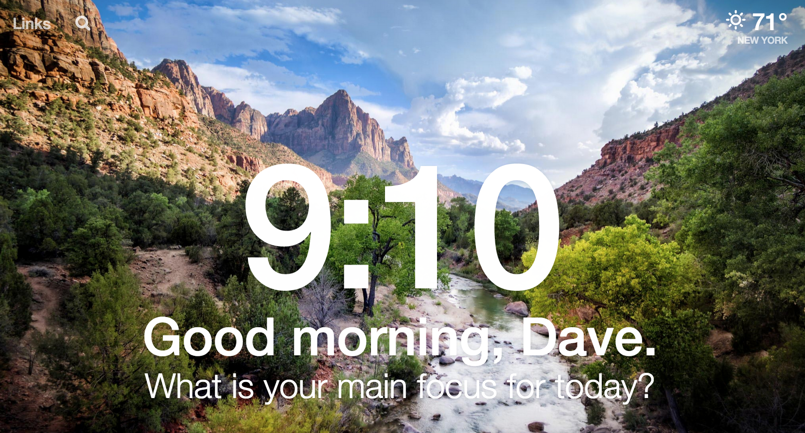
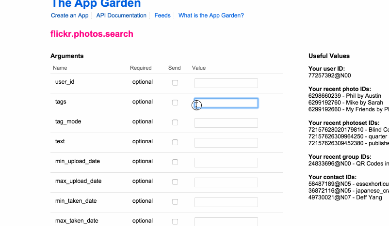

# This magic moment 



[Momentum](https://chrome.google.com/webstore/detail/momentum/laookkfknpbbblfpciffpaejjkokdgca?hl=en) is a personal dashboard that includes time, weather and your daily tasks to focus on.

Today we're going to create a version in Sinatra.

## Objectives

- Practice writing dynamic routes

- Practice making API calls

- Practice mixing in CSS and JavaScript

- Practice learning new libraries and reading documentation

### Completion

First aim to reach the MVP (parts 1 through 3). 
Then you can move forward and implement additional features.

## Setup

Create a new Sinatra app called `momentum_app`
Be sure to include `sinatra-contrib` for Sinatra::Reloader, `pry` for debugging,
and `rest-client` for making server-side HTTP API requests in Ruby.

Since we want to practice CSS and JavaScript as well, include
`normalize.css` and `jquery-2.1.4` as static assets.

# Part 1

When a user visits "/" they should be greeted with a page that displays the 
current time and says "What's your focus today?". The current time should be 
updating every second.

If the user clicks on "What's your focus today?" we should reveal a form 
with a text field to add an item or "task" for a user to focus on and a 
submit button. 

When the user enters a task and clicks submit then we should create a 
POST request to "/tasks", store the task and then redirect to "/"

Under "What's your focus today?" We should then see a list of any tasks that 
have been added. 

# Part 2

Include an "Edit" link on the page. When a user clicks "Edit" direct them to 
"/profile/edit" and display a form where the user can enter a name and 
current location. When the user fills out the form and clicks submit we 
should create a POST request to "/profile", store the information and then 
redirect to "/"

If the user entered a name they should now see "What's your focus today, {name}?"
And their location should appear in the top right.

# Part 3

The [Open Weather Map API](http://openweathermap.org/api) provides an API
to retrieve weather and temperature information. Research in the documentation
how to construct a URL to retrieve the temperature for a location in JSON.

When a user visits "/weather" and they have set a location then we should 
look up the temperature using the [Open Weather API](http://openweathermap.org/current) 
and display the temperature in imperial units. 

# Part 4

Work on formatting the current time to look more pleasing. Download and 
include the [moment.js](http://momentjs.com/) library and use it to format 
the time as "2:30 pm".

If you click on the time change the text to show the day's date as 
"January 1".

If you click it again change the text to display the current week number 
as "week 48".

Finally one more click will return the time to the hour minute format.

# Part 5

Include a question on the profile form "Show weather?"  If it's set to 
`true` then include the user's location temperature at the top right of 
the "/" page.

# Part 6

Next we'll want to display a calm and pleasing background photo on "/"

Research how to use the [flickr API](https://www.flickr.com/services/api/explore/flickr.photos.search) to find and output photos in JSON.

Here's an example of using the Explorer page and sample output and URL.



Once you can get photo data you'll have to research how Flickr [format's their URLs](https://www.flickr.com/services/api/misc.urls.html
).

Create another input on '/profile/edit' to allow users to enter a series 
of tags like "beach" or "mountain."

If the user has specified tags use the Flickr API to find a photo and 
display it as the background on the page. 

# Part 7

By now you may have a lot of code in your route handlers. 

Can you extract your code into modules and classes so that you can write code like:

```rb
@temp = OpenWeather.fetch_temp_for(city, units: imperial)
```

Can you expose an API at "/tasks.json" that returns a string of json for all your 
task?

# Part 8

Let's turn down the lights. Can you create different template layouts, so that 
when it's after 6pm you render a darker colored theme.

# Resources
- [Flickr API](https://www.flickr.com/services/apps/create/)
- [Moment.js](http://momentjs.com/docs/#/displaying/)
- [Rest-Client](https://github.com/rest-client/rest-client)
- [How I explained REST to my wife](http://www.looah.com/source/view/2284)
- [Sinatra docs](http://www.sinatrarb.com/documentation.html)
- [OpenWeather API](http://openweathermap.org/)
- [Momentum](https://chrome.google.com/webstore/detail/momentum/laookkfknpbbblfpciffpaejjkokdgca?hl=en)

