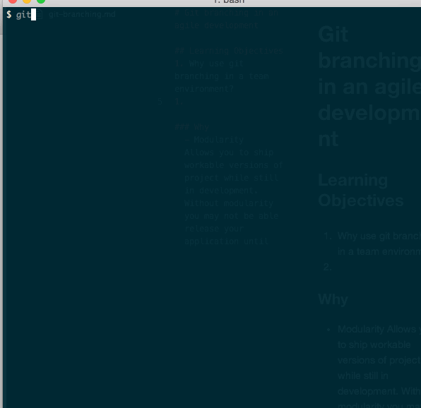

# Let's talk about Git...

## Objective for the exercise
The goal of this exercise is to expose you to the what it's like working on a programming project with multiple developers utilizing Git.

**Warning: This will look like a Frankenstein application - it most likely will not be pretty AT ALL. The point of the exercise is exposure.** So, Enjoy :)

## Setup
After you've been divided into your respective groups, choose **one** member from the group to create a new rails application with postgresql **OUTSIDE** of your pluto repo and do the following:
  - `cd` into your new rails project directory, use `git init` to initialize a new github repo, and then use `git add --all` and `git commit -m "adds new rails project"` to commit your new rails app.
  - Using the `hub` gem use the command `hub create` in your terminal to create a new repository on your _personal_ github, and then use `git push origin master` to push your rails application to your newly created repo.
  - Visit your github profile, find your newly created repo and then slack the ssh URL to the rest of your team members.
  - Then, **OUTSIDE** of your pluto repo's, everyone else will then use `git clone [paste SSH URL here]` to clone the new repo.
  - The original project owner (team member whose repo the project belongs to) will go back to the repo's page on github and go to Setting -> Collaborators and add all of their teammates as collaborators.

  

## Activity
Within your groups, your assignment is to create a simple rails application with a home page with your team's mission statement (This can be anything, the more entertaining the better) and lists all of your team members by name, and when clicked, will visit a simple profile with the following information (yes this means database):
  - Name
  - email
  - link to their github
  - small bio

Keep in mind all of the tasks that will be necessary to bring this application to life and how you can utilize your team members dividing up the tasks to have it done on time. It may be wise to spend some time in the beginning to go over who should accomplish what.
