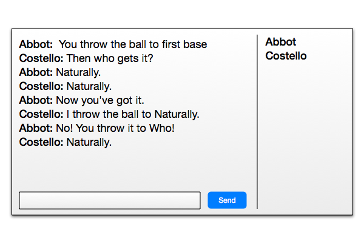

# Friday Lab  /  Weekend Homework

Using the Chat Application you created this morning, add the following features:

#### PART 1: Identify Yourself Program!

The ability to chat is great, but it's nice to know who you are talking to when you do.  In the activity this morning, we sent the user name with each message.  In order for the server to track who is connected, we must make a few modifications to this.

---


---

```js
var express = require('express');
var app     = express();
var server  = app.listen(3000);
var io      = require('socket.io')(server);

app.use(express.static('/public'));

io.on('connection', function(socket){
  socket.emit('authorize');
});
```

When a user connects, the server should ask the client to identify itself by sending an `authorize` event.

When the client receives an `authorize` event, it should `prompt` the user to provide their name, and emit a `register` event with the user's information.

When the server receives a `register` event, it should save the user's name to an Array that contains all of the connected users.

#### PART 2: Validation

What if a user doesn't enter a name, and we get an empty string `""` on the backend?  What if two users enter the same name?

When an invalid user name is entered, the prompt should repeat until a valid user name is provided.  Ensure the user name is not an empty string, and that it hasn't been taken.

#### PART 3: You Have Been Disconnected

When a user disconnects, we need to remove their name from the list.

#### PART 4: Improved Messaging

###### Emoticons

Let's add some polish to the messages that go out.  An quick-and-easy win is to allow users to type emoticons!  Let's modify our chat app so that when a user sends a message containing an emoticon, it is replaced with an smiley face Emoji :smile: (or an image if you prefer).

###### Timestamps

Next, let's add a date to each message, so our users can tell when a message was sent.  You should use the Date from the server, just in case your users are in different timezones, or their computer's clock is off.

**BONUS:** Use [timeago](http://timeago.yarp.com/) to show the message times using a "relative time", e.g. "30 minutes ago"

###### Listing Users

We want to be able to see a list of current users when a user types '/users'. Update your client-side javascript to detect the string '/users' and broadcast a 'get users' event. The server should respond to that event by sending the list of connected users to the front-end.

###### Puppy Me!

Now add the ability to type '/puppyme' and get an image from the Giphy API. As in the previous step, listen for the appropriate string and and emit an event. When the server gets this event, it should hit the [Giphy API](https://github.com/Giphy/GiphyAPI) for a puppy gif and broadcast it to all users.

#### STEP 5: Building the Buddy List (**BONUS**)



Let's switch back to our front-end for a bit, and create a space for us to list out all of our connected users.  Since a buddy list is a "list", semantic HTML suggests you build this as a `<ul>`.

The next challenge is to populate it with our list of names.  The problem is that our list is on our server.  You are going to have to send the list to the browser from the server.  Additionally, you are going to need to *update* the list whenever a user connects or disconnects.

**BONUS:** When a user begins typing into the chat text box, figure out how to add the text "*typing*" next to their name for all users in the list.  Consider adding a class to the `<li class="typing">jaden</li>` to provide custom styling.
